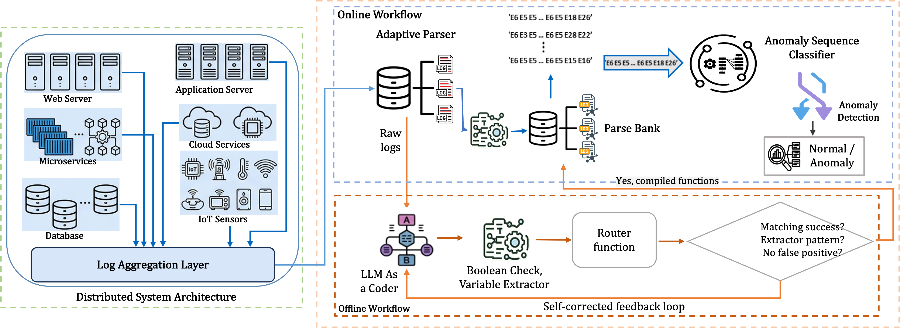
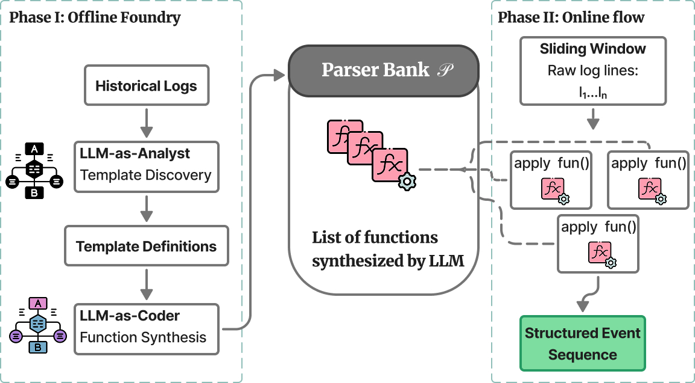
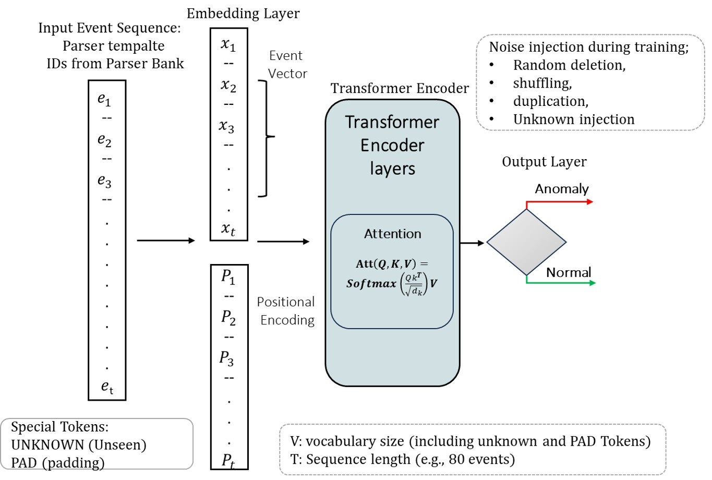

# CLAD: Contextual Log Anomaly Detection

> 📄 **Publication**: This work will be published in the **45th IEEE International Symposium on Reliable Distributed Systems (SRDS 2026)**.

CLAD is a two-stage tool for log analysis in distributed systems. An LLM
is used **offline** to synthesize one small Python
parsing function per log template, compiled into a *Parser Bank*; at runtime,
parsing is deterministic function matching with no LLM calls. A lightweight
Transformer classifier then labels sliding windows of parsed event IDs as
normal or anomalous in real time.

⚡ **New**: CLAD now ships with an easy-to-use command-line interface
([`cli.py`](cli.py)) — parse or classify any log file or raw log line with a
single command, no notebooks required. See
[Command Line Interface (CLI)](#command-line-interface-cli).

---

## Authors & Affiliation

* **Hadjou Ilyas** (`hadjousslab@knu.ac.kr`)
* **Irshad Khan** (`irshad.cs@knu.ac.kr`)
* **Young-Woo Kwon** (`ywkwon@knu.ac.kr`)

**School of Computer Science and Engineering, Kyungpook National University, Daegu, South Korea.**

---

## System Architecture

<p align="center">
  
  <br>
  <em><b>Fig. 1:</b> Overview of the CLAD framework, consisting of contextual log parsing and Transformer-based anomaly sequence classification.</em>
</p>

<br>

<p align="center">
  
  <br>
  <em><b>Fig. 2:</b> CLAD-Parser architecture: an offline foundry compiles historical templates into a Parser Bank.</em>
</p>

<p align="center">
  
  <br>
  <em><b>Fig. 5:</b> Architecture of CLAD-Classifier.</em>
</p>

---

## Repository layout

```
CLAD_Framework/
├── quickstart.py                  # end-to-end run on bundled data (offline, CPU-ok)
├── cli.py                         # command-line interface: parse / classify / both
├── requirements.txt
├── docs/                          # architecture diagrams (Fig 1 - Fig 5)
├── data/
│   ├── loghub-2k/                 # bundled Loghub-2k logs (11 systems)
│   ├── drain-2k/                  # bundled Drain clusters (template grounding)
│   ├── samples/                   # small labeled BGL event stream for the quickstart
│   └── download_full_datasets.sh  # fetches full BGL / Thunderbird / HDFS from Zenodo
├── parser/
│   ├── banks/                     # pre-built Parser Banks (qwen2.5-7b/, qwen3-30b/)
│   ├── synthesis/
│   │   ├── generate_parser_banks.ipynb   # offline Parser Bank synthesis (GPU)
│   │   └── full_scale/                   # full-dataset trainers (BGL/HDFS/Thunderbird)
│   └── eval/
│       ├── run_parser_grounded.py # template-grounded run (paper metrics)
│       ├── run_parser_2k.py       # run a raw bank over the 11 systems
│       ├── score_parser.py        # score predictions against ground truth
│       └── scalability.py         # runtime-scaling experiment
├── classifier/
│   ├── train.ipynb                # train the Transformer classifier
│   ├── test.ipynb                 # evaluate a checkpoint (incl. noise-injection tests)
│   └── models/                    # pre-trained checkpoints
└── realtime/
    ├── BGL/                       # streaming pipeline: parse -> window -> classify
    └── Thunderbird/               # (train + real-time test notebooks, parser bank,
                                   #  checkpoint, vocabulary, per-folder README)
```

## Installation

```bash
python -m venv .venv && source .venv/bin/activate
pip install -r requirements.txt
```

Requirements: Python ≥ 3.10, `torch 2.8.0` (pinned; the shipped checkpoints
were saved with it). GPU is optional for everything except Parser Bank
synthesis, which loads Qwen2.5-Coder-7B in FP16 (≈16 GB VRAM).

## Quick start

Runs entirely from bundled data — no downloads, CPU is sufficient:

```bash
python quickstart.py
```

Step 1 parses the 11 bundled Loghub-2k systems with the CLAD-Parser
(template-grounded: bundled Drain clusters aligned to majority ground-truth
templates, reproducing the paper's PA ≈ 0.98 / GA ≈ 0.94 / TA ≈ 0.91) and
scores the predictions. Step 2 loads the pre-trained real-time BGL
classifier checkpoint and classifies the bundled labeled sample. The run
completes in a few minutes and prints its progress; it should finish with
`Quickstart finished.` and no errors.

## Command Line Interface (CLI)

CLAD provides a command-line interface (`cli.py`) that works out of the box —
parse and classify log streams with a single command. Bank templates are
normalized to the standard `<*>` wildcard style, and lines not covered by a
bank function fall back to generic variable masking (no `UNKNOWN` outputs).

```bash
# parse a raw log line (or a log file) with a pre-built Parser Bank
python cli.py --input "generating core.128" --mode parse

# classify an event stream (CSV with an EventId column) with the real-time checkpoint
python cli.py --input data/samples/labeled_logs_BGL_sample.csv --mode classify

# run both stages and save the results as JSON
python cli.py --input data/samples/labeled_logs_BGL_sample.csv --mode both --output results.json
```

Options:

| Flag | Default | Description |
|------|---------|-------------|
| `--input` | (required) | Path to a log file / CSV, or a literal log text string |
| `--mode` | `both` | `parse`, `classify`, or `both` |
| `--checkpoint` | `realtime/BGL/models/TableVIII_bgl_realtime_classifier.pth` | Pre-trained classifier checkpoint |
| `--output` | — | Optional path to save results as JSON |
| `--system` | `BGL` | Parser Bank system (e.g. `BGL`, `HDFS`, `Apache`) |
| `--bank` | `qwen2.5-7b` | Parser Bank model family (`qwen2.5-7b` or `qwen3-30b`) |

## Running the pipeline on full datasets

```bash
# 1. download raw logs (BGL ≈ 700 MB, Thunderbird ≈ 30 GB unpacked)
bash data/download_full_datasets.sh bgl        # or: thunderbird | hdfs | all

# 2. produce a labeled event stream with the Parser Bank
python realtime/BGL/generate_labeled_bgl_deterministic.py

# 3. train and run the real-time detector
#    open and run: realtime/BGL/train_BGL_Classifer.ipynb
#                  realtime/BGL/test_BGL_realtime.ipynb
```

The Thunderbird pipeline is analogous under `realtime/Thunderbird/`
(`generate_labeled_thunderbird_chunks.py`, then the train/test notebooks).

To synthesize Parser Banks yourself, open
`parser/synthesis/generate_parser_banks.ipynb` and run all cells; regenerated
banks are written to `parser/synthesis/regenerated_output/`.

## Datasets

The bundled Loghub-2k samples are redistributed under the Loghub terms (see
`data/loghub-2k/LOGHUB_LICENSE.txt`). Full datasets are fetched from
[Zenodo record 8196385](https://zenodo.org/records/8196385); please cite the
Loghub paper when using them.
